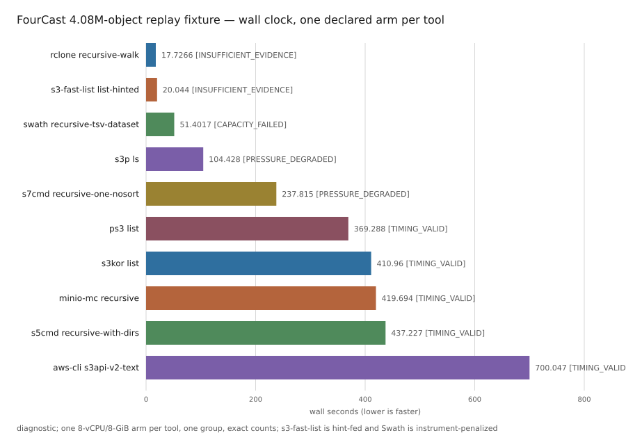

# What we found

We install S3 listing tools, run them against staged copies of real buckets,
and publish every run. This page is the short version. Every claim on it
names the run it rests on, in the table at the end, and the full data is one
click below.

## What we did

Ten tools were pinned by image digest and driven through one harness against
**replay fixtures**: staged copies of real buckets' key listings, served back
by a local server that imitates S3's `ListObjectsV2` with a fixed per-request
latency taken from the real bucket. Fixtures rose from 4.08 million objects to
143 million. A separate, smaller set of runs went against live S3.

The question was not "which tool is fastest". It was: **which approaches
survive a rising object count, and where does each one stop?**

## What we found

Ten tools completed the 4.08-million-object rung. Four reached 143 million.
Each tool that stopped earlier stopped for a reason we can name.

| tool | reached | what stopped it |
| --- | ---: | --- |
| aws-cli, minio-mc, s3kor | 4.08M | One page at a time; the tool has no listing-parallelism control |
| ps3 | 4.08M | Issues several requests per page; its wide arm hit the 30-minute cap |
| s5cmd | 66.4M | No listing fan-out of its own; it ran on shard lists the harness supplied |
| s3-fast-list | 66.4M | Memory: 11.3 GiB resident at 66.4M objects; two of three attempts died at the limit |
| s7cmd | 143M, no count | Paginates each directory serially; one dominant directory was still draining at the 2-hour cap |
| s3p | 143M | Completed; CPU-bound in its cheapest mode |
| rclone | 143M | Completed; nine rows short of the fixture count (directory markers not emitted) |
| Swath | 143M | Completed |

Two more findings:

- **Counts are exact.** Where a run returned a count, it is the fixture's
  exact object count, or the report says by how much it differs. Nothing is
  sampled.
- **A flat namespace separates the designs.** With no directories to fan out
  across, rclone's per-directory walk held about 8 GB in memory and was killed
  at an 8 GiB cap; s7cmd's prefix discovery collapsed to one serial drain;
  Swath's range splitting was unaffected.



The rows behind the figure are
[here](results/2026-09-scale-diagnostics/charts/fourcast-roster.csv). It is
ordered by wall clock and **it is not a ranking**: three of those tools
have no listing-concurrency control, one was fed cut-points by the harness,
and one was slowed by the instrument.

## Swath on live S3

Swath listed a 1.07-billion-object public bucket from one 32-vCPU VM with an
exact count. The whole process, from start to the compressed output on disk
and exit, took 5 minutes 41 seconds; the listing phase inside it took
5 minutes 12 seconds. One run, one day, one bucket, one
tool. It says nothing comparative. The full ladder of live-S3 runs is
[in the report](results/2026-09-scale-diagnostics/REPORT.md#swath-on-live-s3).

## What this does not mean

- **Not a ranking, not a benchmark.** No run here is measurement-grade. The
  release's `manifest.json` says so in machine-readable form
  (`calibrated_replay_benchmark: false`).
- **The instrument has a known defect, and it slows our own tool.** The replay
  server misses its latency budget on directory-rollup requests under load.
  Swath is the tool that issues those at volume, so every Swath timing on the
  three large fixtures failed the study's own timing gate. See
  [how the instrument works](docs/instrument.md).
- **Replay is not S3.** Its per-request latency is a fixed number per bucket
  with no tail, no throttling and no rise under load. It matches what a serial
  client sees within about 10%; it flatters a client fast enough to push S3,
  which no run in this release was.
- **"Ran" and "verified" are separate facts.** Counts are checked against the
  fixture's object count, not key by key.
- **We build Swath and we run this study.** Every page says so.

## The runs behind this page

| claim | attempt |
| --- | --- |
| aws-cli, 4.08M, exact, 700.0 s | `aws-cli.a7d9377bd706.s1` |
| ps3 wide arm, 4.08M, timed out at 1,800 s | `ps3.31a9e4da68b2.s1` |
| s5cmd on harness shards, 66.4M, exact, 352.2 s | `s5cmd.962211b4b344.s1` |
| s3-fast-list, 66.4M, exact, 11,347,320 KiB peak RSS | `s3-fast-list.246cf7252988.s1` |
| s7cmd, 143M, timed out at 7,200 s | `s7cmd.a9b999169187.s1` |
| s3p, 143M, exact, 4,238.8 s | `s3p.1b77f20ed931.s1` |
| rclone, 143M, 143,008,665 of 143,008,674, 667.0 s | `rclone.6319ec57665d.s1` |
| Swath, 143M, exact, 173.7 s | `swath.be4140354dd1.s1` |
| rclone walk killed at 8 GiB on the flat fixture | `rclone.795fbd66217b.s1` |
| s7cmd serial drain on the flat fixture, 1,289.5 s | `s7cmd.97b265107a89.s1` |
| Swath, 1,068,477,307 objects on live S3, 341.4 s | `swath.7b028bd8c692.s1` |

## Drill down

- **[The full report](results/2026-09-scale-diagnostics/REPORT.md)**: every
  rung, every tool's disposition, the instrument's defect in numbers, the
  live-S3 ladder, and what the study does not establish.
- **[How the instrument works](docs/instrument.md)**: the replay server, its
  latency deadlines and where they come from, and its known skews.
- **[The measurement plan](docs/methodology.md)**, written before the
  comparative runs.
- **[Per-tool pages](tools/README.md)**: how each tool lists, with source
  anchors and receipts.
- **The data**, in `results/2026-09-scale-diagnostics/`:
  [`attempts.jsonl`](results/2026-09-scale-diagnostics/attempts.jsonl) (one
  object per run, canonical),
  [`summary.csv`](results/2026-09-scale-diagnostics/summary.csv) (the same
  rows, flat),
  [`manifest.json`](results/2026-09-scale-diagnostics/manifest.json) (claim
  ceiling and disclosures), and
  [`results/README.md`](results/README.md) for the release contract. Check a
  release from a clone, with no private access:

  ```
  uv run python -m benchmark.public_validate \
      --release-dir results/2026-09-scale-diagnostics
  ```
