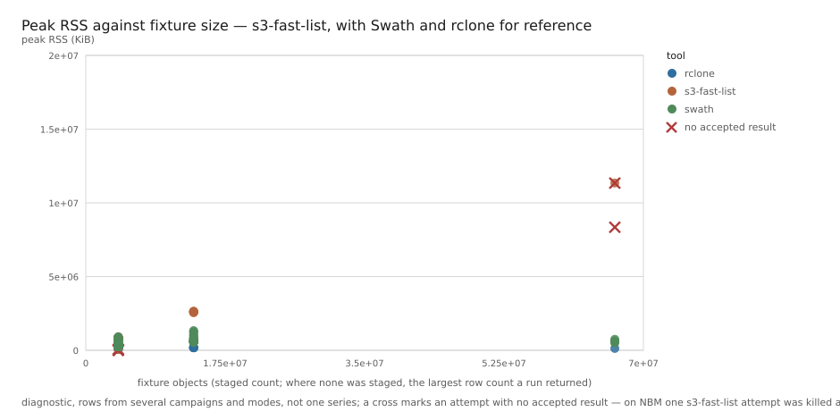
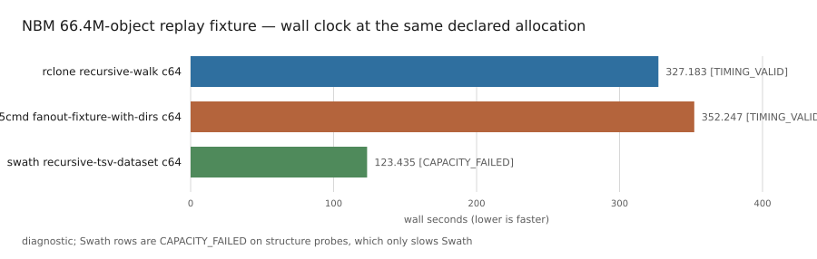
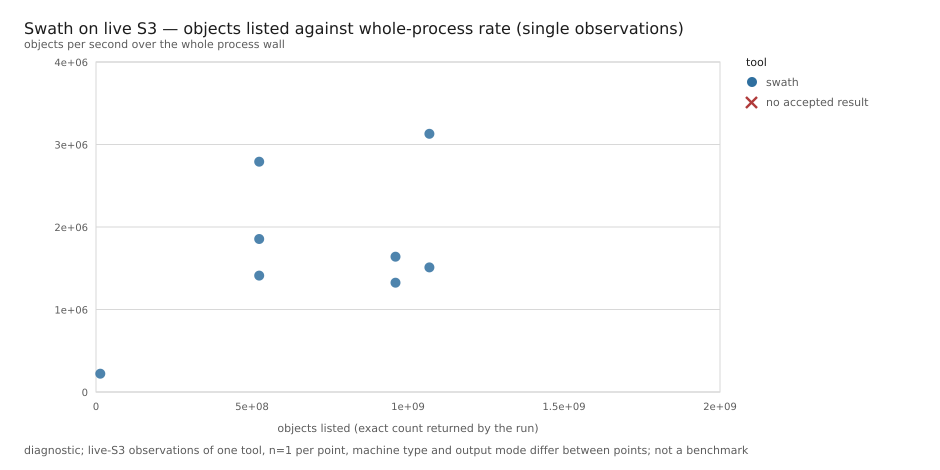

# Ten S3 listing tools in replay to 143M objects, plus Swath alone on live S3 to 1.07B

Release `2026-09-scale-diagnostics` · data as of 2026-09-01 · 270 settled attempts

This is the written companion to the data in this directory. Every number is
quoted from `summary.csv` or `attempts.jsonl` unless the text says otherwise,
and every claim names its attempt in a table. The short version is
[`RESULTS.md`](../../RESULTS.md); the instrument is explained once in
[`docs/instrument.md`](../../docs/instrument.md).

## What this release is

Ten listing tools were pinned by image digest and driven through versions of
one harness against staged replay fixtures of real S3 buckets, from 4.08
million objects to 143 million, plus a small set of Swath runs against live
S3. The question was what each approach could complete in the campaigns we
ran, what happened at the largest fixture attempted, and why the study did or
did not schedule a larger one.

It is a **screening release**. It settles what ran, what each run returned,
how much memory it used, and what happened at the largest fixture attempted
for each tool. It does not settle relative speed. The machine-readable
ceiling in `manifest.json`:

| flag | value |
| --- | --- |
| `controlled_replay_diagnostics` | `true` |
| `calibrated_replay_benchmark` | `false` |
| `live_s3_performance` | `false` |
| `universal_tool_ranking` | `false` |

The release combines several diagnostic campaigns run between 2026-08-26 and
2026-09-01 while the harness, the replay server and Swath were evolving.
Every attempt pins its exact tool, image, platform, fixture and replay
identities (`manifest.json` discloses this as `multi-campaign-corpus`). Rows
from different groups are not comparable merely because they share a
release; the asymmetry table below names the cases that matter.

How to read this report:

- A row is one attempt; a rung is one fixture; an arm is one tool
  configuration on one fixture.
- A timing grade (`TIMING_VALID`, `PRESSURE_DEGRADED`, `CAPACITY_FAILED`,
  `INSUFFICIENT_EVIDENCE`, `NOT_APPLICABLE`) describes the replay instrument,
  not whether the tool succeeded; the grades are defined in
  [`docs/instrument.md`](../../docs/instrument.md).
- "Count matched" is cardinality agreement against a staged fixture count,
  not key-by-key verification. Where no count was staged, the report says
  what the run returned and where the reference comes from.
- A number that is not a field of the public rows is labelled with its
  source: the campaign plan, the runner log, the tool's source, the private
  run summary, or the study's working notes.

Two facts bound every timing here. The replay server missed its own latency
budget on one request shape under load, and the tool that issues that shape at
volume is Swath, the study's own tool, so every Swath timing on the three
small-directory fixtures (NARA, NBM, blockchain) failed the timing gate. And the live-S3 rows are single runs of
one tool.

## The funnel

Each rung is a staged fixture built from a real bucket's listing. "Reached"
means at least one attempt of that tool settled on that fixture, whatever its
outcome.

| rung | objects | count source | tools that reached it |
| --- | ---: | --- | --- |
| `noaa-nws-fourcastnetgfs-pds` | 4,081,170 | capture report, working notes | aws-cli, minio-mc, ps3, rclone, s3-fast-list, s3kor, s3p, s5cmd, s7cmd, Swath |
| `nara-1950-census` | 13,540,310 | capture report, working notes | rclone, s3-fast-list, s3p, s5cmd, s7cmd, Swath |
| `real-changesets` (flat) | 13,868,442 | staged, `fixtures.json` | rclone, s7cmd, Swath |
| `idc-open-data` | 56,311,145 | capture report, working notes | Swath only, with no latency treatment on that fixture |
| `noaa-nbm-grib2-pds` | 66,405,936 | staged, `fixtures.json` | rclone, s3-fast-list, s3p, s5cmd, s7cmd, Swath |
| `aws-public-blockchain` | 143,008,674 | staged, `fixtures.json` | rclone, s3p, s7cmd, Swath |

Three notes on the counts. Where the count source says "working notes", no
fixture bundle summary was staged for this release, so `fixtures.json`
carries `object_count: null` for that fixture and records only
`observed_row_counts`, the distinct counts successful runs returned; a
fixture's count is never inferred from a tool's output. The second,
digest-named FourCast record from the 2026-08-26 screens is treated the same
way; its observed counts are 4,081,170 and 4,081,171, the latter s3kor's
known one-row surplus. Eleven tools were researched; s4cmd has no attempt
here because it lists through the legacy v1 API, which the replay server does
not serve, and needs credentials on live S3 (`roster-subject-not-run`).

One 8-vCPU / 8-GiB arm per tool from group `fc-cpu-corrected-20260828`, each
returning 4,081,170 rows; rows in
[`charts/fourcast-roster.csv`](charts/fourcast-roster.csv). It is ordered by
wall clock and it is not a ranking. Three of those tools have no
listing-concurrency control, one was fed cut-points by the harness, the tools
write different outputs, and only five of the ten rows graded `TIMING_VALID`
(the CSV carries each row's grade). The Swath row is a `0.2.5-SNAPSHOT`
build, the documented exception to the released-version rule; every other row
is a tagged release.

## The largest fixture attempted per tool

"Not advanced" is a study decision, not a measured limit of the tool. The
reason column says why no larger fixture was scheduled; where that reason is
a diagnosis rather than a row field, it comes from the runner log and the
tool's source, not from the release rows.

| tool | largest fixture attempted | why no larger one | attempt |
| --- | --- | --- | --- |
| aws-cli | 4.08M | One serial `ListObjectsV2` chain; no listing-parallelism control. 143M objects would be about 143,000 sequential pages. | `aws-cli.a7d9377bd706.s1` |
| minio-mc | 4.08M | Serial client-side iterator. | `minio-mc.04c17e5ac8da.s1` |
| s3kor | 4.08M | Serial listing; its parallelism is in transfers. | `s3kor.8514c3397199.s1` |
| ps3 | 4.08M | Request amplification: 469,241 replay requests for a 4,082-page fixture. The fairness arm at `--prefix-count 5000` reached the 1,800 s cap without a count; that arm also ran against a replay server capped at 512 concurrent requests and graded `PRESSURE_DEGRADED`, so its wall is not clean. | `ps3.31a9e4da68b2.s1` |
| s5cmd | 66.4M | No listing fan-out of its own; the comparable arms ran on shard lists the harness supplied. Not carried to 143M. | `s5cmd.962211b4b344.s1` |
| s3-fast-list | 66.4M | Memory. One of three NBM attempts was killed at an 8 GiB limit; a second failed at 16 GiB with exit 0 and no recorded reason; the one that completed, at 16 GiB, peaked at 10.8 GiB (11,347,320 KiB). Not carried further, by decision. | `s3-fast-list.246cf7252988.s1` |
| s7cmd | 143M, no count | Parallel prefix discovery, then serial pagination per leaf (from its source). On the skewed 143M fixture it hit the 7,200 s cap (exit 124); that one dominant leaf was still draining is a diagnosis from the runner log. | `s7cmd.a9b999169187.s1` |
| s3p | 143M | Completed in 4,238.8 s in its c16 key-only arm; count matched the staged fixture. This release does not establish CPU or width effects. | `s3p.1b77f20ed931.s1` |
| rclone | 143M | Completed in 667.0 s at c64. Returned 143,008,665 rows, nine short of the fixture; the directory-marker explanation is a diagnosis, not a row field. The c128 arm took 821.0 s. | `rclone.6319ec57665d.s1`, `rclone.3eff2ab4f661.s1` |
| Swath | 143M | Completed in 173.7 s at c256; count matched the staged fixture. Every Swath row on this fixture failed the timing gate; see below. | `swath.be4140354dd1.s1` |

Peak resident memory against fixture size; a cross marks an attempt with no
accepted result. On the 66.4M-object NBM fixture s3-fast-list failed without
an accepted result twice; one was killed at the 8 GiB limit and one exited 0
at 16 GiB. Only NBM has a staged count on this axis; the other points sit at
the largest row count a run returned off that fixture, which the CSV carries
as a separate column. The points come from several campaigns and modes and do
not form one series. Rows in
[`charts/s3-fast-list-rss.csv`](charts/s3-fast-list-rss.csv).

### Where the setup was not equal

| asymmetry | detail | attempts |
| --- | --- | --- |
| replay server size on blockchain | Swath's blockchain rows ran against replay servers of 20, 32 and 64 vCPU, on hosts of 32, 48 and 80 vCPU; every other tool's blockchain row had a 20-vCPU server on a 32-vCPU host. Subject allocations were equal (8 vCPU / 8 GiB), but the host's disk and memory bandwidth are shared (see the instrument section). The fastest row, 173.7 s, is `0.3.1` on the 64-vCPU server; the `0.2.5-SNAPSHOT` c256 rows took 208.9 s and 238.4 s on 20 vCPU and 209.7 s on 32. Two pairs differ only in server size, same build, image, config and server image: c256, 209.7 s on 32 vCPU against 238.4 s on 20; c128, 206.2 s against 217.4 s. Nothing isolates the build from the server size for the 173.7 s row. All are `CAPACITY_FAILED`. | `swath.be4140354dd1.s1` (64, 0.3.1); `swath.9a948772a8d5.s1` (32) and `swath.bfbcc490799b.s1` (20), c256; `swath.67ef93751978.s1` (32) and `swath.c59f4b2e8eed.s1` (20), c128; `swath.9ad793f7eea7.s1` (20); `rclone.6319ec57665d.s1` (20), `s3p.1b77f20ed931.s1` (20) |
| pre-release build in two figures | the Swath row in the FourCast roster figure and in the NBM same-allocation figure is `0.2.5-SNAPSHOT`; the dispositions row is `0.3.1`; every other charted row is a tagged release | `swath.88891b1437de.s1`, `swath.1a8598593dbb.s1` |
| harness-supplied shards | s5cmd's comparable arms ran on shard lists the harness generated from the fixture; the tool has no listing fan-out of its own | `s5cmd.962211b4b344.s1` |
| fixture-derived hints | s3-fast-list's arm was fed keyspace cut-points generated from the fixture | `s3-fast-list.246cf7252988.s1` |
| replay concurrency cap on ps3's wide arm | 512 concurrent requests against 4,096 for its completing arm | `ps3.31a9e4da68b2.s1`, `ps3.55c79d26bce0.s1` |

## Per-tool dispositions
The best-completing arm actually recorded for each tool. The count column
gives `row_count` and its reference: "staged" is the fixture count in
`fixtures.json`; "capture" is the capture report's count in the study's
working notes, because no bundle summary was staged for that fixture. Figures
are `wall_seconds`, `row_count` and `max_rss_kb` for the named attempt; the
tools write different outputs, so the walls are not one common operation.

| tool | version | arm | fixture | wall | count returned | peak RSS (KiB) | delivered timing | attempt |
| --- | --- | --- | --- | ---: | --- | ---: | --- | --- |
| aws-cli | 2.36.1 | `s3api-v2-text` | FourCast 4.08M | 700.0 s | 4,081,170 = capture | 85,076 | `TIMING_VALID` | `aws-cli.a7d9377bd706.s1` |
| minio-mc | RELEASE.2025-08-13T08-35-41Z | `recursive` | FourCast 4.08M | 419.7 s | 4,081,170 = capture | 49,920 | `TIMING_VALID` | `minio-mc.04c17e5ac8da.s1` |
| s3kor | v0.0.37 | `list` | FourCast 4.08M | 411.0 s | 4,081,170 = capture | 50,176 | `TIMING_VALID` | `s3kor.8514c3397199.s1` |
| ps3 | 0.1.16 | `list` c256 | FourCast 4.08M | 369.3 s | 4,081,170 = capture | 92,116 | `TIMING_VALID` | `ps3.55c79d26bce0.s1` |
| s5cmd | v2.3.0 | `fanout-fixture-with-dirs` c64 | NBM 66.4M | 352.2 s | 66,405,936 = staged | 1,380,592 | `TIMING_VALID` | `s5cmd.962211b4b344.s1` |
| s3-fast-list | 1.1.0 | `list-hinted-fixture` c100 | NBM 66.4M | 333.8 s | 66,405,936 = staged | 11,347,320 | `PRESSURE_DEGRADED` | `s3-fast-list.246cf7252988.s1` |
| s3p | 3.7.2 | `ls` c16 | blockchain 143M | 4,238.8 s | 143,008,674 = staged | 335,352 | `TIMING_VALID` | `s3p.1b77f20ed931.s1` |
| s7cmd | 1.5.0 | `recursive-one-nosort` c16 | NARA 13.5M | 601.0 s | 13,540,310 = capture | 111,160 | `CAPACITY_FAILED` | `s7cmd.bdba69aad415.s1` |
| rclone | 1.74.4 | `recursive-walk` c64 | blockchain 143M | 667.0 s | 143,008,665, staged is 143,008,674 | 1,893,836 | `TIMING_VALID` | `rclone.6319ec57665d.s1` |
| Swath | 0.3.1 | `recursive-tsv-dataset` c256 | blockchain 143M | 173.7 s | 143,008,674 = staged | 2,232,392 | `CAPACITY_FAILED` | `swath.be4140354dd1.s1` |

Wall clock on the 66.4M-object NBM fixture at one declared allocation. The
Swath row is `CAPACITY_FAILED` on structure probes, which slows Swath, and it
is the `0.2.5-SNAPSHOT` build; the model's other skews are not measured, so
the figure establishes no cross-tool ratio, and the three tools write
different outputs. It is kept in this report and not on the findings page for
that reason. Rows in
[`charts/nbm-same-allocation-wall.csv`](charts/nbm-same-allocation-wall.csv).

Standing notes per tool:

- **aws-cli, minio-mc, s3kor**: serial by construction; correct; flat in
  memory; not carried up the ladder.
- **ps3**: completes at 4M; the wider fairness arm timed out.
- **s5cmd**: completes only with harness-supplied shards; that asymmetry is
  disclosed wherever it is charted.
- **s3-fast-list**: completed NBM with fixture-derived cut-points; memory
  constrained further study.
- **s3p**: completed 143M; count matched the staged fixture.
- **s7cmd**: matched the capture count at 13.5M; returned no count on NBM
  (exit 1, all four arms); capped on the skewed 143M fixture.
- **rclone**: reaches 143M nine rows short; on NARA its six rows returned
  13,540,306 or 13,540,116 against the capture's 13,540,310; memory is the
  constraint on a flat namespace.
- **Swath**: reaches 143M; slowed by the instrument on the small-directory
  fixtures; built by the organisation that maintains this study.

## The instrument in this release

The replay server and its latency model are explained in
[`docs/instrument.md`](../../docs/instrument.md). This section records only
how the instrument behaved in this release.

**The defect.** On the fixtures with many small directories, NARA, NBM and
blockchain, the server missed the `structure_probe` deadline under page load.
The cause is the server's sorted-Parquet seek: a `delimiter=/` rollup reopens a
row-group reader and decodes a whole key page per seek, so a rollup costs far
more than a page, the inverse of S3.

| measurement on `aws-public-blockchain`, c256, replay 64 vCPU / 20 GiB | cold server | warmed server |
| --- | ---: | ---: |
| attempt | `swath.be4140354dd1.s1` | `swath.6d4bdaf4f615.s1` |
| declared deadlines, worker / pivot / structure (ms) | 94 / 46 / 55 | 94 / 46 / 55 |
| delivered structure-probe mean, as a ratio of 55 ms | 2.07 | 2.03 |
| structure probes that overran | 46.0% | 45.4% |
| warm-up requests before the run (`replay.requests.before`) | 0 | 2,400 |
| subject wall | 173.7 s | 174.5 s |
| count returned | 143,008,674 = staged | 143,008,674 = staged |
| delivered timing | `CAPACITY_FAILED` | `CAPACITY_FAILED` |

The warm-up (2,000 / 200 / 200 requests over 27,891 prefixes in 7.3 s; the
composition is from the campaign plan and the runner log, only the 2,400
total is a release field) tested the hypothesis that the overrun was
cold-path cost. It changed nothing, so the
per-seek cost is the defect. The ratio and overrun figures come from the
ledger's delivered-timing evidence; the walls, counts and `requests.before`
values are in the release rows. A warmed server is a different treatment
identity, so the warmed row is exported as its own case.

**Who it touches.** Swath issues structure probes at volume alongside its
page load, and every Swath row on the three fixtures is `CAPACITY_FAILED`.
Other tools also have `CAPACITY_FAILED` rows: s7cmd on NARA and blockchain,
one s3-fast-list row on NBM, and several FourCast rows of rclone, ps3, s3p and
s7cmd from the earlier, smaller replay allocation. This release's row schema
does not carry the failing reason for those. rclone's directory walk, which
also issues delimiter requests at volume, classifies `PRESSURE_DEGRADED` on
NARA, `TIMING_VALID` on NBM, and on blockchain `TIMING_VALID` at c64 and
`PRESSURE_DEGRADED` at c128.

**What that means for comparisons.** Where a Swath row is set beside a
`TIMING_VALID` or `PRESSURE_DEGRADED` row of another tool, the defect runs
against Swath. The treatment's other skews (no tail, no rise under load,
pricing by request syntax) are not measured well enough to call any
cross-tool ratio a bound in either direction. Where both rows are
`CAPACITY_FAILED`, nothing is established.

**Shared host.** The replay server and the subject run on one VM with CPU
sets separated by physical core. The fixture the server reads and the output
the subject writes sit on the same boot disk, so disk bandwidth, page cache
and memory bandwidth are shared, and no disk metric is exported
(`shared-host-disk` in the manifest). Subjects that write more (Parquet,
compressed TSV) compete more with the server than subjects that write text.

**The deadlines, checked.** After this release's rows settled, a same-bucket
serial control was run on the four replay fixtures (2026-09-02, from the same
zone, 100 unsigned pages one at a time over one keep-alive connection):

| fixture | worker deadline | serial p50 | serial mean |
| --- | ---: | ---: | ---: |
| FourCast | 85 | 74.5 | 78.8 |
| NBM | 87 | 78.0 | 81.0 |
| NARA | 86 | 92.3 | 95.6 |
| blockchain | 94 | 95.8 | 101.1 |

Two deadlines sit 11–14% above the serial median (`us-east-1`) and two sit
2–7% below it (`us-east-2`). A deadline above the serial median is applied
uniformly to every request; how much wall time it adds depends on each
tool's request count, shapes and concurrency. The control and the August serial-tool cross-check are described in
[`docs/instrument.md`](../../docs/instrument.md); both are internal checks,
not published receipts, and no row here depends on them. The manifest
discloses the model's limits as `latency-model-is-not-s3`.

## The flat namespace

A flat namespace, with no interior slashes, is the shape that separates
prefix-parallel designs from range-parallel ones. The fixture is a live-S3
Swath capture of `real-changesets`: 13,868,442 rows, digest
`295177c9…c57edd`. Every arm ran on `n4-highcpu-32` with the subject at 8 vCPU
/ 8 GiB and replay at 20 vCPU / 20 GiB, deadlines 122 / 88 / 88 ms for
worker / pivot / structure.

| arm | wall | count | peak RSS (KiB) | delivered timing | attempt |
| --- | ---: | --- | ---: | --- | --- |
| Swath c64 `recursive-tsv-dataset` | 47.5 s | matched staged | 369,512 | `INSUFFICIENT_EVIDENCE` | `swath.666e471aac76.s1` |
| s7cmd c16 `recursive-one-nosort` | 1,289.5 s | matched staged | 50,944 | `TIMING_VALID` | `s7cmd.97b265107a89.s1` |
| rclone c64 `recursive-walk`, 8 GiB | 1,401.8 s | none | 8,369,376 | `TIMING_VALID` | `rclone.795fbd66217b.s1` |
| rclone c64 `recursive-walk`, 16 GiB | 1,377.6 s | matched staged | 8,121,012 | `TIMING_VALID` | `rclone.d92a513cb0f2.s1` |
| rclone `lsjson --fast-list -R` (server-side recursion), 8 GiB | 1,851.8 s | matched staged | 73,764 | `TIMING_VALID` | `rclone.997236778cca.s3` |

What the rows show:

- **The per-directory walk holds the whole result set in memory.** At 8 GiB it
  was killed (subject exit -9) after issuing all 13,869 pages; that it had
  written nothing is from the runner log, not a release field. At 16 GiB it completed with 7.7 GiB resident. That is the footprint
  of `recursive-walk`, not of rclone: its `--fast-list` arm, which uses
  server-side recursive listing, completed the same cell in 72 MiB. Both arms
  are explicit, non-default flag sets.
- **Prefix discovery collapses to one serial drain.** With no sub-prefixes to
  divide, s7cmd paginated the whole bucket sequentially.
- **Range splitting does not need directories** to divide the keyspace, and
  the Swath arm completed the cell with a matching count. Its 47.5 s run
  collected fewer than five 10-second replay samples, so it has no
  delivered-timing grade; its wall is a functional result, not a timing.
- **Two rclone modes, one pagination, two wall clocks.** Both modes issued
  13,869 pages. The walk paginates with `delimiter=/`, which the server prices
  at the 88 ms structure deadline; the streaming mode uses plain pages at  122 ms. That 34 ms per-page discount is the instrument pricing by syntax,
  not one mode listing faster, and on this fixture it favours the walk and
  s7cmd's drain. The first two `--fast-list` attempts failed before producing
  evidence (`MISSING_EVIDENCE`); that they were Spot-preempted comes from the
  runner log, not the release rows.

## Swath on live S3

These rows ran against live public buckets from one VM in GCP `us-east1`,
unsigned reads, one run each, no other subject present. They are observations,
not measurements: the buckets are not under our control, the machine types and
output modes differ, and nothing was repeated. `manifest.json` discloses them
as `real-s3-rows-are-single-observations`.

| bucket | objects | Swath | machine | mode | process wall, start to exit | objects/s over process wall | attempt |
| --- | ---: | --- | --- | --- | ---: | ---: | --- |
| `real-changesets` | 13,868,442 | 0.3.1 | n4-highcpu-16 | sorted Parquet c1024 | 62.7 s | 221,259 | `swath.85ccd37c1b88.s1` |
| `fah-public-data-covid19-absolute-free-energy` | 522,925,693 | 0.3.0 | n4-highcpu-16 | sorted Parquet c1024 | 370.7 s | 1,410,484 | `swath.d7668a13dc4c.s1` |
| same | 522,925,693 | 0.3.1 | n4-highcpu-32 | sorted Parquet c2048 | 281.9 s | 1,854,866 | `swath.4b2db6e9f6a9.s1` |
| same | 522,925,693 | 0.3.1 | n4-highcpu-32 | TSV + zstd c2048 | 187.3 s | 2,791,827 | `swath.a0f1b2c053d8.s1` |
| `janelia-cosem-datasets` | 959,831,933 | 0.3.0 | n4-highcpu-16 | sorted Parquet c1024 | 724.2 s | 1,325,437 | `swath.0b5db9b35947.s1` |
| same | 959,831,933 | 0.3.1 | n4-highcpu-32 | sorted Parquet c2048 | 585.1 s | 1,640,372 | `swath.0d01af45ef74.s1` |
| `sentinel-cogs` | 1,068,443,985 | 0.3.0 | n4-highcpu-32 | sorted Parquet c1024 | 707.4 s | 1,510,392 | `swath.6b1ffae260c0.s1` |
| `sentinel-cogs` | 1,068,477,307 | 0.3.1 | n4-highcpu-32 | TSV + zstd c2048 | 341.4 s | 3,129,747 | `swath.7b028bd8c692.s1` |

"Process wall" is the whole run from start to exit, including writing the
output to disk; the listing phase alone is shorter, and only the process wall
is in the release rows (for the billion-object run, 5 m 12 s of listing inside
5 m 41 s of process). Objects per second divides the count by that process
wall, so it understates the listing rate. The two `sentinel-cogs` counts
differ because the bucket changed between runs; each is the integer that run
returned, and neither was verified against a key manifest, because none
exists for a changing public bucket.

One point per run, machine type and output mode differ between points; rows
in [`charts/real-s3-ladder.csv`](charts/real-s3-ladder.csv).

### The billion-object run, and its boundary

In one uncontrolled live-S3 run, Swath 0.3.1 returned 1,068,477,307 rows
from `sentinel-cogs` and exited after 341.4 s, including writing compressed
TSV to disk (`swath.7b028bd8c692.s1`). No reference manifest exists for a
live bucket, so that is the count the run returned, not a verified count.
The public row carries the process wall and the count; its `listing_seconds`
and `native_summary` are null. The private run summary, which is not in this
release, recorded a listing phase of 5 m 12 s and the compressed TSV on disk
at about 5 m 39 s (`prose-cites-private-evidence` in the manifest).

| boundary | detail |
| --- | --- |
| one run | one day, one bucket, not repeated; no interval exists |
| one machine | a Standard `n4-highcpu-32` in `us-east1`, listing a `us-west-2` bucket over the public internet |
| client-side limit, per the private summary | about 25 of 32 cores were producing compressed TSV, and S3 returned no `SlowDown`; neither is a release field, and no CPU or I/O metric is exported |
| not 5M keys/s | the whole-process rate is 3.13M objects/s; the listing phase alone is faster, and neither reaches 5M/s |
| one tool | no other subject ran against live S3 in this release's window; the August live pass predates this ledger and is not exported |
| listing, not inventory | key, size, ETag, modification time and storage class; not a comparison with S3 Inventory |

## What this study does not establish

- **It does not rank listing tools.** The subjects were built for different
  jobs, several have no listing-parallelism control, and the arms compared
  are not equivalent configurations of one design.
- **It does not establish anyone's performance on live S3**, except as the
  one-tool observations above, which are single uncontrolled runs.
- **It does not establish a calibrated replay comparison.** The instrument
  missed its declared budget on one request shape, so no row is a
  measurement.
- **It does not establish correctness.** Counts are checked against a staged
  fixture count where one exists, and against the capture's count in working
  notes where none was staged; never key by key. "Ran" and "verified" are
  separate facts.
- **It does not establish scaling behaviour.** Each live-S3 point has a
  different machine, output mode, region, bucket shape, and in three cases a
  different Swath version.
- **It does not establish tuning conclusions.** Concurrency arms separated by
  single-run noise under a pressured instrument are not evidence of a knee.
- **It says nothing about a bucket it did not list**, nor about
  S3-compatible stores, versioned buckets, or credentialed access.

Swath is built by the organisation that runs this study. That is disclosed on
every page, the run-record rules applied to it are the ones applied to every
other subject, and the one instrument defect found in this release slows Swath
rather than favouring it.

## Audit, and the reproduction boundary

The release is internally auditable, not independently reproducible. The
public files expose configurations, attempt identities, fixture digests,
outcomes and derived figures. The fixture bytes, the campaign ledger, the
per-attempt result files, the logs and the listing products are not
published, and the source buckets change, so re-listing one yields a new
fixture rather than the old digest. A reader cannot rerun the identical
replay experiment from this repository alone (`fixtures-not-published` in the
manifest). Group-to-plan attribution in `manifest.json.groups` is declared in
the release spec and hashed at export, not recorded at submission; it is an
editorial mapping to the current plan file.

| to check | where |
| --- | --- |
| a claim | filter `summary.csv` on `attempt_id`, or read the row in `attempts.jsonl`: verbatim `invocation.argv`, image digests, evidence digests |
| a figure | each chart has its rows beside it as CSV; the selection rule is `benchmark/publication/charts.yaml` |
| a case | plans under `benchmark/plans/campaigns/`; group-to-plan attribution in `manifest.json.groups`; the harness in `benchmark/README.md` and `benchmark/docs/running.md` |
| the release's integrity | `uv run python -m benchmark.public_validate --release-dir results/2026-09-scale-diagnostics`, from a clone, no private access; it checks checksums, structure and the measurement gate, not every derived value or the prose |

## Publication decisions

- Fixtures are published as digests and shape metrics only: no listing data
  and no key material.
- Failed and cancelled attempts stay in the rows with their `state` and
  `state_detail`. A settled attempt with no evidence is data, not an omission.
- 18 attempts against licence-restricted workloads are withheld; the
  manifest's `workloads-withheld` disclosure names the reason.
- No generated site. The release is this directory and this report.
- No cost figure is quoted; the row schema carries none. A later export may
  add a Spot list-price estimate, labelled as such.

## Corrections

A release directory may be regenerated or resealed while it lives on a draft
branch; it is immutable once an annotated tag or GitHub Release names it. A
correction after that is a new release whose manifest names what it
supersedes; see the policy in `results/README.md`. The checksums are
integrity metadata, not a signature: the authentic boundary is the tag.
